# ruhrohhalp Creator OS — Product Requirements Document

## Executive Summary

**ruhrohhalp Creator OS** is an autonomous social media content pipeline built into the ruhrohhalp Next.js app. It generates, audits, scores, queues, schedules, publishes, and learns from Threads posts — with minimal human intervention. Tyler Young (NYC runner, software engineer, founder of BearDuckHornEmpire LLC) is the sole user.

**Mission**: Deliver on-brand, timely, high-engagement Threads content at scale with zero friction.

---

## System Architecture Overview

### Technology Stack

| Component | Technology |
|-----------|-----------|
| **Framework** | Next.js 15 (App Router, TypeScript) |
| **UI** | React 19 |
| **Backend** | Supabase (PostgreSQL + pgvector + RLS) |
| **AI Generation** | Anthropic Claude Sonnet 4.6 |
| **Safety Audit** | Groq Llama 4 Scout |
| **Embeddings** | Hugging Face BGE-M3 |
| **Deployment** | Vercel (Hobby plan — 1 cron job) |
| **Scheduling** | Vercel Cron + Cowork Scheduled Tasks |

---

## System Architecture Diagram

```mermaid
flowchart TD
    subgraph input["📥 Context Gathering"]
        CALENDAR["📅 Calendar Events"]
        GOALS["🎯 Active Goals"]
        TASKS["✅ Tasks"]
        BRIEFING["📰 Latest Briefing"]
        TOP_POSTS["⭐ Top-Performing Posts"]
    end

    subgraph gen["🤖 Content Generation"]
        GATHER["POST /api/creator/generate<br/>Aggregate Context"]
        CLAUDE["Claude Sonnet 4.6<br/>CONTENT_AGENT_SYSTEM"]
        SELF_SCORE["Self-Score<br/>confidence: 0-1<br/>brand_voice: 0-1<br/>timeliness: 0-1"]
    end

    subgraph audit["🛡️ Safety & Audit"]
        GROQ["Groq Llama 4 Scout<br/>SAFETY_AUDIT_SYSTEM"]
        AUDIT_DECISION{Audit Result}
        APPROVE["✅ Approve"]
        FLAG["⚠️ Flag<br/>→ Draft"]
        REJECT["❌ Reject<br/>→ Discard"]
    end

    subgraph queue["📦 Queueing & Selection"]
        QUEUE_INSERT["Insert into<br/>content_queue<br/>status=queued"]
        SCORE_8["8-Factor Scoring<br/>Algorithm"]
        FACTORS["15% Agent Confidence<br/>10% Content Type Diversity<br/>10% Time-of-Day Fit<br/>10% Post Length Fit<br/>10% Analytics Boost<br/>10% Freshness<br/>20% Brand Voice<br/>15% Timeliness"]
        GREEDY["Greedy Selection<br/>Pick Highest → Update Diversity → Re-score"]
        SELECTED["Selected Posts<br/>Ready to Publish"]
    end

    subgraph publish["📤 Publishing Triggers"]
        CRON["⏰ Vercel Cron<br/>6:00 AM ET<br/>source: cron"]
        COWORK_12["📱 Cowork Task<br/>12:00 PM ET<br/>source: cowork"]
        COWORK_6["📱 Cowork Task<br/>6:00 PM ET<br/>source: cowork"]
        COWORK_9["📱 Cowork Task<br/>9:30 PM ET<br/>source: cowork"]
        MANUAL["👤 Manual Trigger<br/>Creator Dashboard<br/>source: manual"]
    end

    subgraph threads["🔗 Threads Adapter"]
        CREATE_CONTAINER["Create Container"]
        POLL["Poll for FINISHED"]
        PUBLISH_THREADS["Publish to Threads"]
        MULTI_THREAD["Multi-Post Threads<br/>Sequential Reply Chain<br/>5s Delay"]
        STATUS_UPDATE["Update content_queue<br/>status=posted<br/>post_id, post_url"]
    end

    subgraph external["🔄 External Sync"]
        SYNC_EXT["syncExternalPosts<br/>Discover Manual Posts"]
        IMPORT["Import with<br/>source=external"]
        EXT_QUEUE["Add to Queue<br/>for Analytics"]
    end

    subgraph analytics["📊 Analytics & Learning"]
        COLLECT["collectAnalytics<br/>Fetch: impressions,<br/>likes, replies, reposts, quotes"]
        PER_TYPE["Per-Content-Type<br/>Engagement Averages"]
        FEEDBACK["💬 Manual Feedback<br/>Rating 1-5<br/>+ Text Feedback"]
        EMBED["🧠 Semantic Memory<br/>Top 20% & Bottom 20%<br/>→ BGE-M3 Embeddings"]
    end

    subgraph tokens["🔐 Token Management"]
        TOKEN_CHECK["Check Token Expiry<br/>Refresh if < 7 days"]
        REFRESH["Exchange for<br/>Long-Lived Token<br/>~60 day lifetime"]
        STORE["Store in<br/>platform_tokens"]
    end

    subgraph settings["⚙️ Dynamic Settings"]
        POSTS_PER_JOB["posts_per_job<br/>default: 2"]
        MAX_BACKFILL["max_backfill<br/>default: 6/day"]
        STALE_AFTER["stale_after_days<br/>default: 7"]
        ENFORCE["Enforce caps<br/>during publish"]
    end

    %% Flow connections
    CALENDAR --> GATHER
    GOALS --> GATHER
    TASKS --> GATHER
    BRIEFING --> GATHER
    TOP_POSTS --> GATHER

    GATHER --> CLAUDE
    CLAUDE --> SELF_SCORE
    SELF_SCORE --> GROQ

    GROQ --> AUDIT_DECISION
    AUDIT_DECISION -->|Approved| APPROVE
    AUDIT_DECISION -->|Flagged| FLAG
    AUDIT_DECISION -->|Rejected| REJECT

    APPROVE --> QUEUE_INSERT
    QUEUE_INSERT --> SCORE_8
    SCORE_8 --> FACTORS
    FACTORS --> GREEDY
    GREEDY --> SELECTED

    SELECTED --> CRON
    SELECTED --> COWORK_12
    SELECTED --> COWORK_6
    SELECTED --> COWORK_9
    SELECTED --> MANUAL

    CRON --> CREATE_CONTAINER
    COWORK_12 --> CREATE_CONTAINER
    COWORK_6 --> CREATE_CONTAINER
    COWORK_9 --> CREATE_CONTAINER
    MANUAL --> CREATE_CONTAINER

    CREATE_CONTAINER --> POLL
    POLL --> PUBLISH_THREADS
    PUBLISH_THREADS --> MULTI_THREAD
    MULTI_THREAD --> STATUS_UPDATE

    CRON --> TOKEN_CHECK
    TOKEN_CHECK --> REFRESH
    REFRESH --> STORE

    CRON --> SYNC_EXT
    SYNC_EXT --> IMPORT
    IMPORT --> EXT_QUEUE

    STATUS_UPDATE --> COLLECT
    EXT_QUEUE --> COLLECT

    COLLECT --> PER_TYPE
    PER_TYPE --> FEEDBACK
    FEEDBACK --> EMBED
    EMBED -.->|Update future scoring| SCORE_8

    COWORK_12 --> ENFORCE
    COWORK_6 --> ENFORCE
    COWORK_9 --> ENFORCE
    ENFORCE --> MAX_BACKFILL

    POSTS_PER_JOB -.->|Configurable| GREEDY
    STALE_AFTER -.->|Auto-expire| SELECTED

    classDef input fill:#e1f5ff,stroke:#01579b,stroke-width:2px
    classDef gen fill:#f3e5f5,stroke:#4a148c,stroke-width:2px
    classDef audit fill:#fff3e0,stroke:#e65100,stroke-width:2px
    classDef queue fill:#e8f5e9,stroke:#1b5e20,stroke-width:2px
    classDef publish fill:#fce4ec,stroke:#880e4f,stroke-width:2px
    classDef threads fill:#f1f8e9,stroke:#33691e,stroke-width:2px
    classDef external fill:#ede7f6,stroke:#3f2c70,stroke-width:2px
    classDef analytics fill:#fce4ec,stroke:#640e0e,stroke-width:2px
    classDef tokens fill:#e0f2f1,stroke:#004d40,stroke-width:2px
    classDef settings fill:#fff9c4,stroke:#f57f17,stroke-width:2px

    class input input
    class gen gen
    class audit audit
    class queue queue
    class publish publish
    class threads threads
    class external external
    class analytics analytics
    class tokens tokens
    class settings settings
```



---

## Detailed Architecture

### 1. Content Generation Pipeline

#### 1.1 Context Gathering (POST `/api/creator/generate`)

The system starts by pulling the user's daily context:

- **Calendar Events**: Upcoming meetings, runs, personal events
- **Active Goals**: Current professional and personal objectives
- **Tasks**: In-progress and upcoming todo items
- **Latest Briefing**: News, industry trends, relevant updates
- **Top-Performing Posts**: Previous high-engagement content for pattern reference

This context is aggregated and sent to the AI generation layer.

#### 1.2 AI Generation (Claude Sonnet 4.6)

- **System Prompt**: `CONTENT_AGENT_SYSTEM` provides brand voice, tone guidelines, and content strategy
- **Output**: 5 Threads posts per batch (including 1 multi-post thread)
- **Self-Scoring**: Each generated post includes:
  - `confidence_score` (0-1): Model's confidence in the post quality
  - `brand_voice_score` (0-1): Alignment with brand voice and tone
  - `timeliness_score` (0-1): Relevance to current events and context

#### 1.3 Safety Audit (Groq Llama 4 Scout)

Every generated post is independently audited using the `SAFETY_AUDIT_SYSTEM` prompt:

| Decision | Action |
|----------|--------|
| **Approve** ✅ | Post queued for scheduling |
| **Flag** ⚠️ | Post moved to draft status for human review |
| **Reject** ❌ | Post discarded (not stored) |

---

### 2. Smart Selection & Scoring Algorithm

When a publish job runs (daily or on-demand), the system selects posts using an **8-factor scoring algorithm**:

#### Scoring Factors

| Factor | Weight | Description |
|--------|--------|-------------|
| Agent Confidence | 15% | Generation-time self-assessment (confidence_score) |
| Content Type Diversity | 10% | Bonus for content types not yet selected today |
| Time-of-Day Fit | 10% | Peaks at 7-9am, 12-1pm, 5-7pm, 9-10pm ET |
| Post Length Fit | 10% | Sweet spot: 50-200 characters for Threads |
| Analytics Boost | 10% | Above-median engagement for this content type |
| Freshness | 10% | Decays linearly over `stale_after_days` |
| Brand Voice Alignment | 20% | Scored at generation time (brand_voice_score) |
| Timeliness | 15% | Relevance to current events (timeliness_score) |

#### Selection Algorithm

1. **Score all queued posts** using the 8-factor model
2. **Select highest-scored post**
3. **Update diversity set** (mark content type as selected)
4. **Re-score remaining posts** (diversity bonus recalculated)
5. **Repeat** until `posts_per_job` posts selected

This greedy approach maximizes immediate quality while preserving diversity.

---

### 3. Publishing Infrastructure

The system operates on a **multi-trigger architecture** to maximize coverage while respecting platform rate limits:

#### 3.1 Vercel Cron (6:00 AM ET)

**Full daily job** (`source: "cron"`):
1. Gather today's context
2. Sync external Threads posts (manual posts made outside the app)
3. Expire stale drafts (older than `stale_after_days`)
4. Publish queued posts (score and select)
5. Collect analytics on previously published content
6. Refresh platform tokens if expiring within 7 days

#### 3.2 Scheduled Cowork Tasks (12pm, 6pm, 9:30pm ET)

**Backfill-aware publish** (`source: "cowork"`):
- Respects `max_backfill` cap (default: 6 posts/day across all cowork tasks)
- Useful when user reopens laptop mid-day
- Prevents accidental flooding of platform

#### 3.3 Manual Publish (On-Demand)

**From Creator Dashboard** (`source: "manual"`):
- "Publish Now" button for immediate control
- No limits applied
- Useful for time-sensitive content

#### 3.4 Single Post Publish

**POST `/api/creator/publish-single`**:
- Publish one specific post by ID
- Granular control for debugging or special cases

#### Publish Capacity

With default settings (`posts_per_job=2`, `max_backfill=6`):

| Trigger | Posts/Interval |
|---------|---|
| Cron (1x daily) | 2 |
| Cowork (3x daily) | 2 each = 6 total, capped by max_backfill |
| Manual | Unlimited |
| **Max theoretical daily output** | **2 (cron) + 6 (cowork) = 8 posts** |

---

### 3.5 Threads Platform Adapter

#### 2-Step Publish Flow

1. **Create Container**: POST request to Threads with post content, media, hashtags
2. **Poll for Finished**: Check status until `FINISHED`, then capture `id`
3. **Publish**: POST to publish endpoint to go live

#### Multi-Post Threads

For threads (replies):
- Sequential publish of replies in order
- 5-second delay between posts for Threads propagation
- Each reply references previous post via `reply_to_id`

#### Rate Limiting

- Platform limit: **250 posts/24hr**
- Current architecture max: 8/day
- Buffer: 242 posts before hitting limit

#### Token Management

- **Lifetime**: ~60 days (long-lived token via Threads API)
- **Refresh Logic**: Automatic refresh if expiring within 7 days
- **Storage**: `platform_tokens` table with user_id, access_token, refresh_token, expires_at

---

### 4. Analytics & Learning Loop

#### 4.1 Metrics Collection (`collectAnalytics()`)

For each posted content, the system fetches:
- **Impressions**: Total views
- **Likes**: Direct likes
- **Replies**: Comment count
- **Reposts**: Share count
- **Quotes**: Quote posts
- **Follows Gained**: Net new followers attributed to post

Metrics stored in `post_analytics` table with `fetched_at` timestamp.

#### 4.2 Per-Content-Type Analytics

Engagement averages calculated per content type:
- **engagement_rate** = (likes + replies + reposts + quotes) / impressions
- Used to boost future scoring of high-performing types

#### 4.3 Semantic Memory (BGE-M3 Embeddings)

- **Top 20% performers**: Embedded and stored
- **Bottom 20% performers**: Embedded and stored as negative examples
- Embeddings indexed in pgvector for similarity search
- Used to inform future generation and selection

#### 4.4 Manual Feedback Loop

Users can rate posted content:
- **Rating**: 1-5 scale
- **Feedback**: Text comments (e.g., "resonated with audience", "too long")
- Embeddings: Feedback embedded and stored for pattern learning

#### 4.5 Feedback-Informed Scoring

Analytics data feeds back into future scoring:
- Content type engagement averages influence Analytics Boost factor
- Semantic memory informs generation prompts
- Manual feedback adjusts brand voice perception

---

### 5. External Post Sync

#### `syncExternalPosts()`

Discovers posts created outside the app (manually in Threads):
- Polls Threads API for user's recent posts
- Identifies posts not in `content_queue` (by comparing post_id)
- Imports with `source: "external"`
- Adds to queue for analytics tracking

**Benefit**: Full picture of user's activity, including organic/manual posts in analytics.

---

### 6. Dynamic Settings

All settings are configurable per-user in the `creator_settings` table:

| Setting | Default | Purpose |
|---------|---------|---------|
| `posts_per_job` | 2 | Posts to publish per cron/cowork/manual trigger |
| `max_backfill` | 6 | Daily cap for cowork-triggered publishes |
| `stale_after_days` | 7 | Days before queued posts auto-expire |

**Update endpoint**: PATCH `/api/creator/settings`

---

## Database Schema

### 1. `content_queue` (Core Pipeline)

Tracks all content from generation through publishing and analytics.

| Column | Type | Description |
|--------|------|-------------|
| `id` | UUID | Primary key |
| `user_id` | UUID | FK to users |
| `platform` | TEXT | 'threads', 'instagram', 'tiktok' (extensible) |
| `content_type` | TEXT | 'thought', 'tip', 'story', 'thread', 'question' |
| `body` | TEXT | Post text content |
| `media_urls` | TEXT[] | Array of image/video URLs |
| `hashtags` | TEXT[] | Array of hashtags |
| `scheduled_for` | TIMESTAMP | When to publish (nullable if draft) |
| `status` | TEXT | 'draft', 'approved', 'queued', 'posting', 'posted', 'failed', 'expired' |
| `post_id` | TEXT | Platform post ID (null until published) |
| `post_url` | TEXT | Full post URL (null until published) |
| `attempts` | INT | Number of publish attempts |
| `max_attempts` | INT | Max retries before failure |
| `last_error` | TEXT | Last error message |
| `context_snapshot` | JSONB | Context used during generation |
| `agent_reasoning` | TEXT | Why AI generated this post |
| `confidence_score` | FLOAT | 0-1 model confidence |
| `brand_voice_score` | FLOAT | 0-1 brand alignment |
| `timeliness_score` | FLOAT | 0-1 current relevance |
| `source` | TEXT | 'cron', 'cowork', 'manual', 'external' |
| `created_at` | TIMESTAMP | When content was generated |
| `updated_at` | TIMESTAMP | Last status update |

### 2. `platform_tokens` (OAuth Management)

Stores platform authentication tokens with auto-refresh logic.

| Column | Type | Description |
|--------|------|-------------|
| `id` | UUID | Primary key |
| `user_id` | UUID | FK to users |
| `platform` | TEXT | 'threads', 'instagram', etc. |
| `access_token` | TEXT | Current access token (encrypted in production) |
| `refresh_token` | TEXT | For token refresh (encrypted in production) |
| `token_type` | TEXT | e.g., 'Bearer' |
| `expires_at` | TIMESTAMP | Token expiry time |
| `scopes` | TEXT[] | Granted permission scopes |
| `platform_user_id` | TEXT | Platform-specific user ID |
| `platform_username` | TEXT | Display name on platform |

### 3. `post_analytics` (Engagement Metrics)

Stores historical engagement data for learning.

| Column | Type | Description |
|--------|------|-------------|
| `id` | UUID | Primary key |
| `user_id` | UUID | FK to users |
| `content_queue_id` | UUID | FK to content_queue |
| `platform` | TEXT | 'threads', 'instagram', etc. |
| `post_id` | TEXT | Platform post ID |
| `impressions` | INT | Total views |
| `likes` | INT | Direct likes |
| `replies` | INT | Comments |
| `reposts` | INT | Shares/retweets |
| `quotes` | INT | Quote posts |
| `follows_gained` | INT | Net new followers |
| `engagement_rate` | FLOAT | Calculated engagement % |
| `fetched_at` | TIMESTAMP | When metrics were collected |

### 4. `creator_settings` (Dynamic Configuration)

Per-user settings for pipeline behavior.

| Column | Type | Description |
|--------|------|-------------|
| `id` | UUID | Primary key |
| `user_id` | UUID | FK to users (unique) |
| `posts_per_job` | INT | Posts per publish trigger (default 2) |
| `max_backfill` | INT | Daily cowork cap (default 6) |
| `stale_after_days` | INT | Draft expiry threshold (default 7) |

### 5. `media_library` (Asset Management)

Stores media for potential reuse and organization.

| Column | Type | Description |
|--------|------|-------------|
| `id` | UUID | Primary key |
| `user_id` | UUID | FK to users |
| `storage_path` | TEXT | Cloud storage location (Supabase Storage) |
| `thumbnail_path` | TEXT | Thumbnail URL |
| `file_name` | TEXT | Original filename |
| `mime_type` | TEXT | 'image/jpeg', 'video/mp4', etc. |
| `file_size_bytes` | INT | File size in bytes |
| `tags` | TEXT[] | User-defined tags for discovery |
| `source` | TEXT | 'upload', 'external', 'generated' |
| `used_in_posts` | UUID[] | Post IDs that used this media |
| `quality_score` | FLOAT | 0-1 estimated quality (optional) |

### 6. `content_feedback` (Learning Signals)

Captures manual feedback for pattern learning.

| Column | Type | Description |
|--------|------|-------------|
| `id` | UUID | Primary key |
| `user_id` | UUID | FK to users |
| `content_queue_id` | UUID | FK to content_queue |
| `feedback_type` | TEXT | 'rating', 'comment', 'tag' |
| `rating` | INT | 1-5 scale (null if not a rating) |
| `feedback` | TEXT | Free-form user notes |

---

## API Routes

### Content Generation

**POST `/api/creator/generate`**
- Aggregates context (calendar, goals, tasks, briefing, top posts)
- Calls Claude Sonnet 4.6 with CONTENT_AGENT_SYSTEM
- Runs safety audit on each post
- Stores approved posts in queue, flags drafts, discards rejected
- Returns generated posts with scores

**Request Body**:
```json
{
  "include_external_sync": true,
  "override_posts_count": 3
}
```

**Response**:
```json
{
  "success": true,
  "posts_generated": 5,
  "posts_approved": 4,
  "posts_flagged": 1,
  "posts_rejected": 0,
  "queue_summary": {
    "total_queued": 12,
    "ready_to_publish": 8
  }
}
```

### Queue Management

**GET `/api/creator/queue`**
- List queued posts with filters (status, content_type, date range)
- Includes scoring breakdown for transparency

**Query Parameters**:
- `status`: Filter by status (draft, approved, queued, etc.)
- `limit`: Number of posts to return
- `offset`: Pagination offset

**PATCH `/api/creator/queue/:id`**
- Update post metadata (content, hashtags, scheduled_for)
- Change status manually (approve draft, reject queued)
- Add feedback/notes

### Publishing

**POST `/api/creator/publish`**
- Runs scoring algorithm on queued posts
- Selects `posts_per_job` posts
- Publishes to Threads platform
- Updates statuses and stores post IDs/URLs
- Called by Vercel cron and cowork tasks

**Request Body**:
```json
{
  "source": "cron"
}
```

**Response**:
```json
{
  "success": true,
  "published": [
    {
      "id": "post-uuid-1",
      "body": "Post text...",
      "post_id": "threads-post-id",
      "post_url": "https://threads.net/@user/post-id",
      "final_score": 0.87
    }
  ],
  "failed": []
}
```

**POST `/api/creator/publish-now`**
- Publish all ready posts immediately
- No limits (distinct from cowork-triggered publishes)
- Source: "manual"

**POST `/api/creator/publish-single`**
- Publish one specific post by ID
- Useful for debugging or overriding timing

**Request Body**:
```json
{
  "content_queue_id": "post-uuid",
  "source": "manual"
}
```

**POST `/api/creator/publish-cowork`**
- Publish queued posts via Cowork scheduled task
- Respects `max_backfill` cap
- Source: "cowork"

**Request Body**:
```json
{
  "max_backfill": 6,
  "posts_per_job": 2
}
```

### Analytics

**GET `/api/creator/analytics`**
- Aggregated performance data
- Per-content-type engagement averages
- Engagement trends over time
- Top/bottom performing posts

**Query Parameters**:
- `time_range`: 'week', 'month', 'all'
- `content_type`: Filter by type
- `metric`: 'impressions', 'engagement_rate', etc.

**Response**:
```json
{
  "period": "last_7_days",
  "total_posts": 8,
  "total_impressions": 45230,
  "avg_engagement_rate": 0.089,
  "by_content_type": {
    "thought": { "avg_engagement": 0.095, "posts": 3 },
    "tip": { "avg_engagement": 0.081, "posts": 2 },
    "thread": { "avg_engagement": 0.102, "posts": 1 }
  },
  "top_5_posts": [...]
}
```

### Settings

**GET `/api/creator/settings`**
- Retrieve current settings

**PATCH `/api/creator/settings`**
- Update dynamic configuration

**Request Body**:
```json
{
  "posts_per_job": 3,
  "max_backfill": 8,
  "stale_after_days": 10
}
```

### Sync & Feedback

**POST `/api/creator/sync`**
- Discover external Threads posts (manual posts not in queue)
- Import with source: "external"

**Request Body**:
```json
{
  "limit": 10
}
```

**POST `/api/creator/feedback`**
- Submit manual feedback on published post
- Rating (1-5) and optional text

**Request Body**:
```json
{
  "content_queue_id": "post-uuid",
  "rating": 4,
  "feedback": "Great engagement from audience"
}
```

---

## Scheduling Architecture

The system operates on a **Vercel Hobby plan** (1 cron job limit) complemented by **Cowork scheduled tasks** for higher frequency.

### Execution Schedule

| Trigger | Time (ET) | Frequency | Source | Behavior |
|---------|-----------|-----------|--------|----------|
| **Vercel Cron** | 6:00 AM | Daily | cron | Full job: briefing, sync, expire, publish, analytics, token refresh |
| **Cowork Task** | 12:00 PM | Daily | cowork | Publish batch (respects max_backfill) |
| **Cowork Task** | 6:00 PM | Daily | cowork | Publish batch (respects max_backfill) |
| **Cowork Task** | 9:30 PM | Daily | cowork | Publish batch (respects max_backfill) |
| **Manual** | On-demand | As needed | manual | Publish Now button, no limits |

### Backfill Logic

When the Cowork app reopens mid-day:
1. Scheduled tasks trigger at their designated times
2. Each task checks `max_backfill` and respects the daily cap
3. If cap reached, queued posts remain in queue for next window
4. Manual publishes bypass the cap for urgent content

---

## Platform Adapter Pattern

The system uses an **abstract PlatformAdapter** interface to support multiple platforms:

```typescript
interface PlatformAdapter {
  publish(post: Post): Promise<PublishResult>;
  getPostMetrics(postId: string): Promise<Metrics>;
  listUserPosts(limit: number): Promise<Post[]>;
  exchangeCodeForToken(code: string): Promise<Token>;
  refreshLongLivedToken(token: Token): Promise<Token>;
}
```

### Current Implementation

**ThreadsAdapter**: Full implementation for Threads API
- 2-step container creation and publish flow
- Multi-post thread support with reply chain
- Token refresh with 7-day buffer

### Future Implementations

- **InstagramAdapter**: Carousel posts and Reels
- **TikTokAdapter**: Video content with hashtag tracking
- **LinkedInAdapter**: Professional content (future consideration)

---

## Safety Architecture

Two-layer validation ensures brand safety and content quality:

### Layer 1: Generation-Time Scoring (Claude Sonnet 4.6)

- Guided by CONTENT_AGENT_SYSTEM prompt
- Generates `brand_voice_score` and `timeliness_score`
- Self-confidence assessment included

### Layer 2: Independent Audit (Groq Llama 4 Scout)

- Independent safety audit using SAFETY_AUDIT_SYSTEM
- Three-tier decision:
  - **Approve**: Post queued immediately
  - **Flag**: Moved to draft status for human review
  - **Reject**: Discarded (not stored)

### Rationale

Two independent models prevent:
- Single-model bias or drift
- Brand voice violations
- Tone deafness
- Factual inaccuracies
- Policy violations

---

## Key Features & Benefits

| Feature | Benefit |
|---------|---------|
| **Autonomous Generation** | 5 posts per batch with zero manual writing |
| **Smart Scoring** | 8-factor algorithm balances confidence, diversity, timing, and voice |
| **Two-Layer Audit** | Safety checks ensure brand-safe content |
| **Multi-Trigger Publishing** | Cron + cowork + manual = flexible, responsive system |
| **Analytics Learning Loop** | Semantic memory improves future generations |
| **Extensible Platform Adapter** | Easy to add Instagram, TikTok, LinkedIn |
| **Dynamic Settings** | Adjust posts_per_job, max_backfill on-the-fly |
| **Token Auto-Refresh** | No manual intervention needed for OAuth tokens |
| **External Post Sync** | Captures full user activity for accurate analytics |
| **Backfill-Aware Scheduling** | Respects rate limits while maximizing coverage |

---

## Future Roadmap

### Phase 2: Media & Variants

- **Media Library Integration**: Auto-attach relevant images/videos from library
- **A/B Testing**: Multiple variants per time slot, performance tracking
- **Auto-Generated Graphics**: Generate quote cards, stat graphics

### Phase 3: Audience & Intelligence

- **Audience Insights**: Integration with Threads analytics for demographic targeting
- **Trend Detection**: Real-time trending topic detection for timeliness
- **Competitor Benchmarking**: Compare engagement against similar creators

### Phase 4: Cross-Platform

- **Instagram Carousel**: Multi-image carousel posts
- **Instagram Reels**: Video integration for Reels platform
- **TikTok Adapter**: Short-form video generation and publishing
- **LinkedIn Adapter**: Professional thought leadership content

### Phase 5: Advanced ML

- **Fine-Tuned LLM**: Custom model trained on user's top-performing posts
- **Predictive Scoring**: ML model predicts engagement before publishing
- **Automated Captions**: Generate video captions for accessibility
- **Sentiment Analysis**: Automated tone-matching to user's current mood/context

---

## Monitoring & Observability

### Metrics to Track

- **Generation Quality**: % approved vs. flagged vs. rejected
- **Publishing Health**: Publish success rate, retry rate, failure reasons
- **Content Performance**: Avg engagement by content type, day-of-week trends
- **Token Health**: Expiry rate, refresh count, failure count
- **System Load**: Cron job execution time, API latency, queue depth

### Error Handling

- Publish failures logged with retry count and last error message
- Flagged posts notify user (email/dashboard) for review
- Token refresh failures alert user to re-authenticate
- Rate limit tracking prevents API quota exhaustion

---

## Security & Privacy

### Data Protection

- **RLS (Row-Level Security)**: Supabase ensures user isolation
- **Token Encryption**: Sensitive tokens encrypted at rest
- **Audit Logging**: All publishes, deletes, updates logged
- **HTTPS Only**: All API calls over TLS

### Rate Limiting

- **Threads API**: 250 posts/24hr limit respected
- **Cowork Tasks**: Daily backfill cap prevents flooding
- **Generation**: Claude API usage tracked and budgeted

### User Control

- Manual approval workflow for flagged content
- Granular settings for output volume
- "Publish Now" vs. scheduled for different use cases
- Feedback loop for continuous improvement

---

## Success Metrics

| Metric | Target |
|--------|--------|
| **Weekly Publishing Consistency** | 8+ posts/week (2 cron + 6 cowork) |
| **Content Approval Rate** | >85% approved posts (low flag rate) |
| **Avg Engagement Rate** | >8% (above-median for creator category) |
| **AI Confidence Accuracy** | 90%+ (high-confidence posts outperform) |
| **System Uptime** | 99%+ (cron + cowork tasks) |
| **Token Refresh Success** | 100% (no auth failures) |
| **Time to Publish** | <5 seconds (container to published) |

---

## Technical Debt & Considerations

- **Token Encryption**: Move to environment-based secret management
- **Rate Limit Tracking**: Implement proactive limit monitoring
- **Multi-User Support**: Current design is single-user; roadmap includes multi-user
- **Webhook Support**: Real-time analytics instead of polling
- **Batch Embedding**: Improve semantic memory update performance

---

## Conclusion

The **ruhrohhalp Creator OS** is a fully autonomous content pipeline that balances **quality, consistency, and flexibility**. With two-layer safety checks, sophisticated scoring, and a feedback loop that improves over time, it enables Tyler to maintain a strong Threads presence with minimal manual intervention while staying true to his brand voice and maximizing engagement.

The extensible platform adapter pattern and roadmap position the system for growth into Instagram, TikTok, and beyond — while the Cowork-powered scheduling architecture ensures sustainable daily output within platform rate limits.
